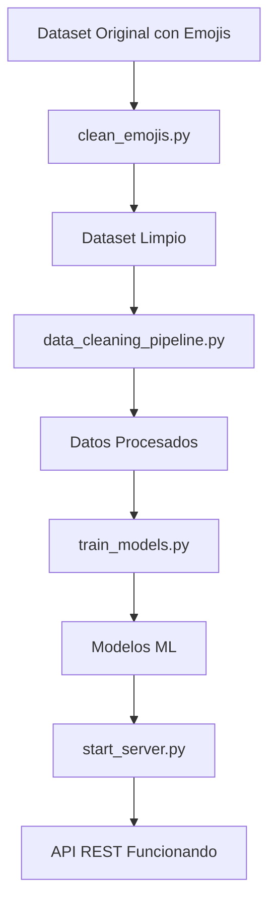

# Restaurant Recommender ML - Backend

Sistema de recomendación de restaurantes en Lima usando Machine Learning.

## Estado del Proyecto

 **Limpieza de Emojis Completada** 
 **Pipeline de Datos Actualizado** 
 **API REST Configurada** 

---

## Estructura del Proyecto

```
backend/
 data/
 raw/ # Datos crudos
 Lima_Restaurants_2025_08_13_clean.csv # Dataset limpio (sin emojis)
 restaurant_metadata.csv # Metadatos
 processed/ # Datos procesados por pipeline
 restaurantes_limpio.csv
 reviews_limpio.csv
 reviews_con_sentimiento.csv
 models/ # Modelos ML (solo esenciales)
 sentiment_model.pkl # Modelo de sentimientos (84.36%)
 clustering_model.pkl # Clustering de restaurantes
 rating_predictor.pkl # Predictor de ratings
 recommender_system.pkl # Sistema de recomendación
 src/ # Código fuente (Clean Architecture)
 application/ # Servicios de aplicación
 services/
 sentiment_service.py
 recommendation_service.py
 dto/ # Data Transfer Objects
 domain/ # Lógica de negocio
 entities/ # Entidades del dominio
 repositories/ # Interfaces de repositorios
 infrastructure/ # Implementaciones
 ml/model_loader.py # Cargador de modelos
 repositories/ # Repositorios CSV
 presentation/ # API REST
 api/
 main.py # App FastAPI
 routes/ # Endpoints
 health.py
 sentiment.py
 recommendations.py
 comparar_modelos.py # Diagnóstico
 diagnosticar_modelo.py # Diagnóstico
 optimizar_modelo_gastronómico.py # Optimización
 reentrenar_modelo_limpio.py # Entrenamiento principal
 start_server.py # Iniciar servidor
 test_api_funcionando.py # Tests
 test_integracion_completa.py # Tests
 requirements.txt # Dependencias
 README.md # Documentación
```

---

## GUÍA DE INICIO RÁPIDO (Para Desarrolladores)

### Requisitos Previos

- **Python 3.10+** instalado
- **pip** (gestor de paquetes de Python)
- **Git** (opcional, para clonar el repositorio)
- **CMD o PowerShell** en Windows

---

## PASO A PASO: Configuración Inicial

### PASO 1: Clonar o Descargar el Proyecto

```bash
# Si usas Git
git clone <URL_DEL_REPOSITORIO>
cd restaurant-recommender-ml/backend

# Si descargaste un ZIP
# Descomprimir y navegar a la carpeta backend
cd C:\AmbDesarrollo\POSTGRADO-SAN-MARCOS\MACHINE-LEARNING\restaurant-recommender-ml\backend
```

---

### PASO 2: Crear Entorno Virtual (Recomendado)

**¿Por qué?** Aisla las dependencias del proyecto de tu Python global.

- **Python 3.10+** instalado
# Crear entorno virtual
python -m venv .venv

# Activar entorno virtual
# En Windows CMD:
.venv\Scripts\activate.bat

# En Windows PowerShell:
.venv\Scripts\Activate.ps1

# En Linux/Mac:
source .venv/bin/activate
```

**Verificar activación:** Deberías ver `(.venv)` al inicio de tu línea de comandos.

---

### PASO 3: Instalar Dependencias

```bash
# Actualizar pip (recomendado)
python -m pip install --upgrade pip

# Instalar todas las dependencias del proyecto
- **pip** (gestor de paquetes de Python)
- **Git** (opcional, para clonar el repositorio)
- **CMD o PowerShell** en Windows
**Dependencias principales instaladas:**
- FastAPI + Uvicorn (API REST)
- Pandas + NumPy (Procesamiento de datos)
- Scikit-learn (Machine Learning)
- NLTK (Procesamiento de lenguaje natural)
- Matplotlib + Seaborn (Visualización)

**Tiempo estimado:** 2-5 minutos dependiendo de tu conexión.

---

### PASO 4: Descargar Recursos de NLTK (Primera vez)

El análisis de sentimientos requiere recursos de NLTK:

```bash
python -c "import nltk; nltk.download('stopwords'); nltk.download('punkt'); nltk.download('wordnet')"
```

---

## EJECUTAR EL PROYECTO

### Opción A: Ejecución Rápida (Recomendada)

Si ya tienes los modelos entrenados:

```bash
python start_server.py
```

**Salida esperada:**
```
 Iniciando Restaurant Recommender API...
 Backend URL: http://localhost:8000
 API Docs: http://localhost:8000/docs
 Modo desarrollo con auto-reload activado
--------------------------------------------------
INFO: Started server process
INFO: Uvicorn running on http://0.0.0.0:8000
```

**Acceder a la API:**
- **Swagger UI:** http://localhost:8000/docs
- **Health Check:** http://localhost:8000/api/v1/health

---

### Opción B: Primera Vez - Entrenar Modelos Completos

Si es tu primera vez o no tienes modelos entrenados:

#### PASO 1: Verificar que tienes los datos limpios

```bash
# Listar archivos en data/raw
dir data\raw

# Deberías ver: Lima_Restaurants_2025_08_13_clean.csv
```

Si **NO** existe el archivo limpio:

```bash
python scripts/clean_emojis.py
```

#### PASO 2: Ejecutar Pipeline de Limpieza de Datos

```bash
python scripts/data_cleaning_pipeline.py
```

**¿Qué hace?**
- Limpia datos de restaurantes
- Limpia datos de reviews
- Detecta y elimina anomalías
- Filtra restaurantes de alta calidad
- Genera datasets procesados en `data/processed/`

**Tiempo estimado:** 5-10 minutos

#### PASO 3: Entrenar Modelo de Sentimientos (NUEVO)

```bash
python reentrenar_modelo_limpio.py
```

**¿Qué hace?**
- Entrena modelo de análisis de sentimientos
- Usa Complement Naive Bayes + Logistic Regression
- Genera modelo ensemble optimizado
- Guarda en `data/models/sentiment_model.pkl`

**Métricas esperadas:**
- Accuracy: ~84%
- Precision Positivos: ~96%
- Recall Positivos: ~90%

**Tiempo estimado:** 10-15 minutos

#### PASO 4: Entrenar Modelos ML Principales

```bash
python scripts/train_models.py
```

**¿Qué hace?**
- Entrena modelo de clustering
- Entrena predictor de ratings
- Entrena sistema de recomendación
- Guarda modelos en `data/models/`

**Tiempo estimado:** 15-20 minutos

#### PASO 5: Iniciar Servidor

```bash
python start_server.py
```

---

## VERIFICAR QUE TODO FUNCIONA

### Test 1: Health Check

```bash
# Usando curl (si tienes instalado)
curl http://localhost:8000/api/v1/health

# Usando PowerShell
Invoke-WebRequest -Uri http://localhost:8000/api/v1/health -UseBasicParsing
```

**Respuesta esperada:**
```json
{
 "status": "healthy",
 "timestamp": "2025-10-24T..."
}
```

### Test 2: Probar API Completa

```bash
python test_api_funcionando.py
```

### Test 3: Test de Integración Completo

```bash
python test_integracion_completa.py
```

---

## DIAGNÓSTICO Y OPTIMIZACIÓN

### Diagnosticar Modelo de Sentimientos

```bash
python diagnosticar_modelo.py
```

**¿Qué muestra?**
- Componentes del modelo
- Métricas de accuracy
- Pruebas con ejemplos reales
- Palabras clave en vocabulario

### Comparar Modelos

```bash
python comparar_modelos.py
```

**¿Qué hace?**
- Compara modelo actual vs optimizado
- Muestra métricas lado a lado
- Prueba con casos de uso reales

### Optimizar Modelo Gastronómico

```bash
python optimizar_modelo_gastronómico.py
```

**¿Qué hace?**
- Analiza casos problemáticos
- Muestra guía de métricas esperadas
- Provee umbrales de confianza para UI
### PASO 1: Clonar o Descargar el Proyecto

```bash
# Si usas Git
git clone <URL_DEL_REPOSITORIO>
cd restaurant-recommender-ml/backend

# Si descargaste un ZIP
# Descomprimir y navegar a la carpeta backend
cd C:\AmbDesarrollo\POSTGRADO-SAN-MARCOS\MACHINE-LEARNING\restaurant-recommender-ml\backend
```

---

### PASO 2: Crear Entorno Virtual (Recomendado)

**¿Por qué?** Aisla las dependencias del proyecto de tu Python global.

```bash
# Crear entorno virtual
python -m venv .venv

# Activar entorno virtual
# En Windows CMD:
.venv\Scripts\activate.bat

# En Windows PowerShell:
.venv\Scripts\Activate.ps1

# En Linux/Mac:
source .venv/bin/activate
```

**Verificar activación:** Deberías ver `(.venv)` al inicio de tu línea de comandos.

---

### PASO 3: Instalar Dependencias

- **Python 3.10+** instalado
# Actualizar pip (recomendado)
python -m pip install --upgrade pip

# Instalar todas las dependencias del proyecto
- **pip** (gestor de paquetes de Python)
- **Git** (opcional, para clonar el repositorio)
- **CMD o PowerShell** en Windows
**Dependencias principales instaladas:**
- FastAPI + Uvicorn (API REST)
- Pandas + NumPy (Procesamiento de datos)
- Scikit-learn (Machine Learning)
- NLTK (Procesamiento de lenguaje natural)
- Matplotlib + Seaborn (Visualización)

**Tiempo estimado:** 2-5 minutos dependiendo de tu conexión.

---

### PASO 4: Descargar Recursos de NLTK (Primera vez)

El análisis de sentimientos requiere recursos de NLTK:

```bash
python -c "import nltk; nltk.download('stopwords'); nltk.download('punkt'); nltk.download('wordnet')"
```

---

## EJECUTAR EL PROYECTO

### Opción A: Ejecución Rápida (Recomendada)

Si ya tienes los modelos entrenados:

```bash
python start_server.py
```

**Salida esperada:**
```
 Iniciando Restaurant Recommender API...
 Backend URL: http://localhost:8000
 API Docs: http://localhost:8000/docs
 Modo desarrollo con auto-reload activado
--------------------------------------------------
INFO: Started server process
INFO: Uvicorn running on http://0.0.0.0:8000
```

**Acceder a la API:**
- **Swagger UI:** http://localhost:8000/docs
- **Health Check:** http://localhost:8000/api/v1/health

---

### Opción B: Primera Vez - Entrenar Modelos Completos

Si es tu primera vez o no tienes modelos entrenados:

#### PASO 1: Verificar que tienes los datos limpios

```bash
# Listar archivos en data/raw
dir data\raw

# Deberías ver: Lima_Restaurants_2025_08_13_clean.csv
```

Si **NO** existe el archivo limpio:

```bash
python scripts/clean_emojis.py
```

#### PASO 2: Ejecutar Pipeline de Limpieza de Datos

```bash
python scripts/data_cleaning_pipeline.py
```

**¿Qué hace?**
- Limpia datos de restaurantes
- Limpia datos de reviews
- Detecta y elimina anomalías
- Filtra restaurantes de alta calidad
- Genera datasets procesados en `data/processed/`

**Tiempo estimado:** 5-10 minutos

#### PASO 3: Entrenar Modelo de Sentimientos (NUEVO)

```bash
python reentrenar_modelo_limpio.py
```

**¿Qué hace?**
- Entrena modelo de análisis de sentimientos
- Usa Complement Naive Bayes + Logistic Regression
- Genera modelo ensemble optimizado
- Guarda en `data/models/sentiment_model.pkl`

**Métricas esperadas:**
- Accuracy: ~84%
- Precision Positivos: ~96%
- Recall Positivos: ~90%

**Tiempo estimado:** 10-15 minutos

#### PASO 4: Entrenar Modelos ML Principales

```bash
python scripts/train_models.py
```

**¿Qué hace?**
- Entrena modelo de clustering
- Entrena predictor de ratings
- Entrena sistema de recomendación
- Guarda modelos en `data/models/`

**Tiempo estimado:** 15-20 minutos

#### PASO 5: Iniciar Servidor

```bash
python start_server.py
```

---

## VERIFICAR QUE TODO FUNCIONA

### Test 1: Health Check

```bash
# Usando curl (si tienes instalado)
curl http://localhost:8000/api/v1/health

# Usando PowerShell
Invoke-WebRequest -Uri http://localhost:8000/api/v1/health -UseBasicParsing
```

**Respuesta esperada:**
```json
{
 "status": "healthy",
 "timestamp": "2025-10-24T..."
}
```

### Test 2: Probar API Completa

```bash
python test_api_funcionando.py
```

### Test 3: Test de Integración Completo

```bash
python test_integracion_completa.py
```

---

## DIAGNÓSTICO Y OPTIMIZACIÓN

### Diagnosticar Modelo de Sentimientos

```bash
python diagnosticar_modelo.py
```

**¿Qué muestra?**
- Componentes del modelo
- Métricas de accuracy
- Pruebas con ejemplos reales
- Palabras clave en vocabulario

### Comparar Modelos

```bash
python comparar_modelos.py
```

**¿Qué hace?**
- Compara modelo actual vs optimizado
- Muestra métricas lado a lado
- Prueba con casos de uso reales

### Optimizar Modelo Gastronómico

```bash
python optimizar_modelo_gastronómico.py
```

**¿Qué hace?**
- Analiza casos problemáticos
- Muestra guía de métricas esperadas
- Provee umbrales de confianza para UI
### PASO 1: Clonar o Descargar el Proyecto

```bash
# Si usas Git
git clone <URL_DEL_REPOSITORIO>
cd restaurant-recommender-ml/backend

# Si descargaste un ZIP
# Descomprimir y navegar a la carpeta backend
cd C:\AmbDesarrollo\POSTGRADO-SAN-MARCOS\MACHINE-LEARNING\restaurant-recommender-ml\backend
```

---

### PASO 2: Crear Entorno Virtual (Recomendado)

**¿Por qué?** Aisla las dependencias del proyecto de tu Python global.

```bash
# Crear entorno virtual
python -m venv .venv

# Activar entorno virtual
# En Windows CMD:
.venv\Scripts\activate.bat

# En Windows PowerShell:
.venv\Scripts\Activate.ps1

# En Linux/Mac:
source .venv/bin/activate
```

**Verificar activación:** Deberías ver `(.venv)` al inicio de tu línea de comandos.

---

### PASO 3: Instalar Dependencias

```bash
# Actualizar pip (recomendado)
- Scikit-learn (Machine Learning)
- NLTK (Procesamiento de lenguaje natural)
## COMANDOS RÁPIDOS DE REFERENCIA
---
### Configuración Inicial (Una sola vez)
```bash
# 1. Crear y activar entorno virtual
python -m venv .venv
.venv\Scripts\activate.bat
### PASO 4: Descargar Recursos de NLTK (Primera vez)
# 2. Instalar dependencias
pip install -r requirements.txt
El análisis de sentimientos requiere recursos de NLTK:
# 3. Descargar recursos NLTK
python -c "import nltk; nltk.download('stopwords'); nltk.download('punkt'); nltk.download('wordnet')"
```
```bash
### Entrenar Modelos (Primera vez o actualización)
python -c "import nltk; nltk.download('stopwords'); nltk.download('punkt'); nltk.download('wordnet')"
# 1. Limpiar datos (si es necesario)

---
# 2. Entrenar modelo de sentimientos (IMPORTANTE)
python reentrenar_modelo_limpio.py

# 3. Entrenar otros modelos ML
## EJECUTAR EL PROYECTO
```

### Ejecutar Servidor (Día a día)
```bash
# Activar entorno (si no está activo)
.venv\Scripts\activate.bat

# Iniciar servidor
python start_server.py

# Acceder a: http://localhost:8000/docs
```

### Diagnóstico y Testing
```bash
# Diagnosticar modelo de sentimientos
python diagnosticar_modelo.py

# Comparar modelos
python comparar_modelos.py

# Optimizar modelo
python optimizar_modelo_gastronómico.py

# Test API
python test_api_funcionando.py

# Test integración
python test_integracion_completa.py
```

---

## Checklist de Verificación

Antes de considerarlo funcionando, verifica:

- [ ] **Python 3.10+** instalado (`python --version`)
- [ ] **Entorno virtual** creado y activado (ves `(.venv)` en terminal)
- [ ] **Dependencias** instaladas (`pip list` muestra fastapi, pandas, etc.)
- [ ] **NLTK resources** descargados
- [ ] **Datos limpios** existen (`data/raw/Lima_Restaurants_2025_08_13_clean.csv`)
- [ ] **Datos procesados** existen (`data/processed/reviews_limpio.csv`)
- [ ] **Modelo de sentimientos** entrenado (`data/models/sentiment_model.pkl`)
- [ ] **Accuracy ≥ 84%** en modelo de sentimientos
- [ ] **Servidor inicia** sin errores (`python start_server.py`)
- [ ] **API responde** (`http://localhost:8000/docs` funciona)
- [ ] **Health check** funciona (`http://localhost:8000/api/v1/health`)

---

## Para Desarrolladores Nuevos

### ¿Nunca has trabajado con Python/ML? Empieza aquí:

1. **Instala Python 3.10+** desde https://www.python.org/downloads/
2. **Abre CMD o PowerShell** en la carpeta del proyecto
3. **Copia y pega estos comandos UNO POR UNO:**

```bash
# Crear entorno virtual
python -m venv .venv

# Activar entorno
.venv\Scripts\activate.bat

# Instalar todo
pip install -r requirements.txt

# Descargar recursos de lenguaje
python -c "import nltk; nltk.download('stopwords'); nltk.download('punkt'); nltk.download('wordnet')"

# Entrenar modelo (ESPERA 10-15 min)
python reentrenar_modelo_limpio.py

# Iniciar servidor

Si ya tienes los modelos entrenados:

4. **Abre tu navegador** en: http://localhost:8000/docs
5. **¡Listo!** Ahora puedes probar la API

---

## Contacto y Soporte

**UNMSM - Machine Learning** 
Postgrado San Marcos

### ¿Tienes problemas?

1. **Revisa la sección** [ Solución de Problemas](#-solución-de-problemas-comunes)
2. **Verifica el checklist** arriba
3. **Ejecuta diagnóstico:** `python diagnosticar_modelo.py`

---

## Siguiente Paso

### Si es tu primera vez:

```bash
# Ejecuta esto en orden:
python reentrenar_modelo_limpio.py # 10-15 min
python start_server.py # Servidor inicia
```

### Si ya tienes todo configurado:

```bash
python start_server.py
```

¡El proyecto está listo para funcionar! 

**Accede a la documentación interactiva:** http://localhost:8000/docs
python start_server.py
```

**Salida esperada:**
```
 Iniciando Restaurant Recommender API...
 Backend URL: http://localhost:8000
 API Docs: http://localhost:8000/docs
 Modo desarrollo con auto-reload activado
--------------------------------------------------
INFO: Started server process
INFO: Uvicorn running on http://0.0.0.0:8000
```

**Acceder a la API:**
- **Swagger UI:** http://localhost:8000/docs
- **Health Check:** http://localhost:8000/api/v1/health

---

### Opción B: Primera Vez - Entrenar Modelos Completos

Si es tu primera vez o no tienes modelos entrenados:

#### PASO 1: Verificar que tienes los datos limpios

```bash
# Listar archivos en data/raw
dir data\raw

# Deberías ver: Lima_Restaurants_2025_08_13_clean.csv
```

Si **NO** existe el archivo limpio:

```bash
python scripts/clean_emojis.py
```

#### PASO 2: Ejecutar Pipeline de Limpieza de Datos

```bash
python scripts/data_cleaning_pipeline.py
```

**¿Qué hace?**
- Limpia datos de restaurantes
- Limpia datos de reviews
- Detecta y elimina anomalías
- Filtra restaurantes de alta calidad
- Genera datasets procesados en `data/processed/`

**Tiempo estimado:** 5-10 minutos

#### PASO 3: Entrenar Modelo de Sentimientos (NUEVO)

```bash
python reentrenar_modelo_limpio.py
```

**¿Qué hace?**
- Entrena modelo de análisis de sentimientos
- Usa Complement Naive Bayes + Logistic Regression
- Genera modelo ensemble optimizado
- Guarda en `data/models/sentiment_model.pkl`

**Métricas esperadas:**
- Accuracy: ~84%
- Precision Positivos: ~96%
- Recall Positivos: ~90%

**Tiempo estimado:** 10-15 minutos

#### PASO 4: Entrenar Modelos ML Principales

```bash
python scripts/train_models.py
```

**¿Qué hace?**
- Entrena modelo de clustering
- Entrena predictor de ratings
- Entrena sistema de recomendación
- Guarda modelos en `data/models/`

**Tiempo estimado:** 15-20 minutos

#### PASO 5: Iniciar Servidor

```bash
python start_server.py
```

---

## VERIFICAR QUE TODO FUNCIONA

### Test 1: Health Check

```bash
# Usando curl (si tienes instalado)
curl http://localhost:8000/api/v1/health

# Usando PowerShell
Invoke-WebRequest -Uri http://localhost:8000/api/v1/health -UseBasicParsing
```

**Respuesta esperada:**
```json
{
 "status": "healthy",
 "timestamp": "2025-10-24T..."
}
```

### Test 2: Probar API Completa

```bash
python test_api_funcionando.py
```

### Test 3: Test de Integración Completo

```bash
python test_integracion_completa.py
```

---

## DIAGNÓSTICO Y OPTIMIZACIÓN

### Diagnosticar Modelo de Sentimientos

```bash
python diagnosticar_modelo.py
```

**¿Qué muestra?**
- Componentes del modelo
- Métricas de accuracy
- Pruebas con ejemplos reales
- Palabras clave en vocabulario

### Comparar Modelos

```bash
python comparar_modelos.py
```

**¿Qué hace?**
- Compara modelo actual vs optimizado
- Muestra métricas lado a lado
- Prueba con casos de uso reales

### Optimizar Modelo Gastronómico

```bash
python optimizar_modelo_gastronómico.py
```

**¿Qué hace?**
- Analiza casos problemáticos
- Muestra guía de métricas esperadas
- Provee umbrales de confianza para UI

---

## Datos del Proyecto

### Dataset Original

**Fuente:** [Lima Restaurant Review - Kaggle](https://www.kaggle.com/datasets/bandrehc/lima-restaurant-review)

**Estadísticas:**
- **706 restaurantes** de alta calidad en Lima
- **378,969 reviews** de clientes
- **Ratings:** 1-5 estrellas
- **Comentarios** en español (análisis de sentimiento)

### Datos Procesados Disponibles

El proyecto incluye datos ya procesados y listos para usar:

```
data/
 raw/
 Lima_Restaurants_2025_08_13_clean.csv (Dataset limpio sin emojis)
 restaurant_metadata.csv (Metadatos adicionales)
 processed/
 modelo_limpio.csv (Para reentrenamiento: 199,821 reviews)
 restaurantes_limpio.csv (706 restaurantes procesados)
 reviews_limpio.csv (378,969 reviews limpias)
 reviews_con_sentimiento.csv (Reviews con análisis aplicado)
```

### Preprocesamiento Aplicado

Los datos ya incluyen:
- Limpieza de emojis y caracteres especiales
- Normalización de texto (lowercase, acentos)
- Eliminación de stopwords en español
- Detección y eliminación de anomalías
- Filtrado de restaurantes de alta calidad
- Balance de clases para entrenamiento

---

## Pipeline de Machine Learning

### Paso 1: Limpiar Emojis ( Completado)

## MÉTRICAS ESPERADAS DEL MODELO

### Modelo de Sentimientos (Accuracy: ~84%)

#### Métricas Generales
```
Accuracy: 84.36% (Mínimo: 75%)
Cohen's Kappa: 56.06%
F1-Score (weighted): 84.64%
F1-Score (macro): 62.51%
```

#### Métricas por Clase

**POSITIVO** (Comentarios buenos)
```
Precision: 95.8% ← De las predicciones positivas, 96% son correctas
Recall: 90.1% ← Detectamos 90% de los comentarios positivos reales
F1-Score: 92.9% ← Balance excelente
```

**NEGATIVO** (Comentarios malos)
```
Precision: 51.7% ← De las predicciones negativas, 52% son correctas
Recall: 87.5% ← Detectamos 88% de los comentarios negativos reales
F1-Score: 65.0% ← Balance aceptable
```

**NEUTRO** (Comentarios informativos)
```
Precision: 34.7% ← Clase más difícil (menos datos)
Recall: 25.8% ← Difícil de detectar
F1-Score: 29.6% ← Esperado que sea menor
```

---

### Umbrales de Confianza para UI

Cuando el modelo hace una predicción, devuelve un % de confianza:

| Confianza | Estado | Color/Icono | Acción Recomendada |
|-----------|------------------|-------------|---------------------------|
| ≥ 90% | MUY CONFIABLE | Verde | Mostrar con seguridad |
| 80-89% | CONFIABLE | Verde | Mostrar normalmente |
| 70-79% | MODERADO | Amarillo | + botón "Revisar" |
| 60-69% | BAJA CONFIANZA | ? Naranja | Sugerir revisión |
| < 60% | INDETERMINADO | Rojo | NO mostrar predicción |

**Ejemplos:**
```
 "La comida estuvo deliciosa"
 → POSITIVO (98.7%) - MUY CONFIABLE

 "Pésimo servicio, muy lento"
 → NEGATIVO (96.9%) - CONFIABLE

 "Comida regular, nada especial"
 → NEUTRO (74.0%) - MODERADO

 "Se atienden todos los domingos"
 → REQUIERE REVISIÓN (45.2%) - INDETERMINADO
```

---

```bash
python scripts/clean_emojis.py
```

**¿Qué hace?**
- Lee `Lima_Restaurants_2025_08_13.csv`
- Elimina emojis y caracteres especiales problemáticos
- Mantiene caracteres latinos (tildes, ñ, etc.)
- Genera:
### Modelo de Machine Learning

**Tipo:** Ensemble Voting Classifier
- **Complement Naive Bayes** (82.24% accuracy)
- **Logistic Regression** (83.36% accuracy)
- **Ensemble** (84.36% accuracy) Usado en producción

**Procesamiento de Texto:**
- TF-IDF Vectorizer (15,000 términos)
- Stopwords en español (NLTK)
- Normalización y limpieza de texto

 - `Lima_Restaurants_2025_08_13_clean.csv` (sin emojis)
 - `Lima_Restaurants_2025_08_13_backup.csv` (backup)

### Paso 2: Pipeline de Limpieza de Datos

```bash
python scripts/data_cleaning_pipeline.py
```

**¿Qué hace?**

**FASE 1: Restaurantes**
1. Limpieza básica → `restaurantes_limpio.csv`
2. Detección de anomalías → `restaurantes_sin_anomalias.csv`
3. Filtro de alta calidad → `restaurantes_alta_calidad.csv`

**FASE 2: Reviews**
1. Limpieza de reviews → `reviews_limpio.csv`
2. Análisis de sentimiento → `reviews_con_sentimiento.csv`

### Paso 3: Análisis Exploratorio (Opcional)

```bash
python scripts/run_eda_analysis.py
```

Genera visualizaciones y estadísticas en `docs/figures/`

### Paso 4: Entrenar Modelos

```bash
python scripts/train_models.py
```

Entrena y guarda modelos ML en `data/models/`:
- `clustering_model.pkl` - Segmentación de restaurantes
- `rating_predictor.pkl` - Predicción de ratings
- `recommender_system.pkl` - Sistema de recomendación

---

## Ejecutar el Servidor API

### Opción 1: Script de Inicio (Recomendado)

```bash
python start_server.py
```

### Opción 2: Uvicorn Directo

```bash
uvicorn src.presentation.api.main:app --reload --host 0.0.0.0 --port 8000
```

### Acceder a la API

Una vez iniciado el servidor:

- **API Base**: http://localhost:8000
- **Documentación Interactiva (Swagger)**: http://localhost:8000/docs
- **Documentación Alternativa (ReDoc)**: http://localhost:8000/redoc
- **Health Check**: http://localhost:8000/api/v1/health

---

## Endpoints Principales

### Health Check
```http
GET /api/v1/health
```

## LIMPIEZA DE ARCHIVOS OBSOLETOS

El proyecto tiene **modelos duplicados** que deben eliminarse para mantener una arquitectura limpia.

### Ver lista completa de archivos a eliminar

Consulta el archivo `ARCHIVOS_A_ELIMINAR.md` que contiene:
- Lista de 6 modelos obsoletos a eliminar
- Comandos para PowerShell y CMD
- Explicación de qué mantener y qué eliminar

### Eliminar Modelos Obsoletos (Rápido)

```bash
# PowerShell
cd C:\AmbDesarrollo\POSTGRADO-SAN-MARCOS\MACHINE-LEARNING\restaurant-recommender-ml\backend

Remove-Item "data\models\sentiment_model_backup_20251024_001208.pkl"
Remove-Item "data\models\sentiment_model_gastro_optimized.pkl"
Remove-Item "data\models\sentiment_model_hibrido.pkl"
Remove-Item "data\models\sentiment_model_mejorado.pkl"
Remove-Item "data\models\sentiment_model_original_20251023_220100.pkl"
Remove-Item "data\models\sentiment_vectorizer.pkl"
```

```cmd
# CMD
cd C:\AmbDesarrollo\POSTGRADO-SAN-MARCOS\MACHINE-LEARNING\restaurant-recommender-ml\backend

del "data\models\sentiment_model_backup_20251024_001208.pkl"
del "data\models\sentiment_model_gastro_optimized.pkl"
del "data\models\sentiment_model_hibrido.pkl"
del "data\models\sentiment_model_mejorado.pkl"
del "data\models\sentiment_model_original_20251023_220100.pkl"
del "data\models\sentiment_vectorizer.pkl"
```

**Espacio liberado:** ~4-5 MB 
**Modelos que quedan:** Solo 4 esenciales (sentiment, clustering, rating, recommender)

---

### Obtener Recomendaciones
```http
POST /api/v1/recommendations
Content-Type: application/json

{
 "user_location": {
 "lat": -12.0464,
 "lng": -77.0428
 },
 "preferences": {
 "category": "Peruano",
 "max_distance_km": 5,
 "min_rating": 4.0
 },
 "top_n": 10
}
```

---

## Solución de Problemas Comunes

### Error: "No module named 'fastapi'" (o similar)

**Causa:** Dependencias no instaladas o entorno virtual no activado.

**Solución:**
```bash
# 1. Verificar que el entorno virtual está activado
# Deberías ver (.venv) al inicio de la línea de comandos

# 2. Si no está activado:
.venv\Scripts\activate.bat # CMD
# o
.venv\Scripts\Activate.ps1 # PowerShell

# 3. Instalar dependencias
pip install -r requirements.txt
```

---

### Error: "No se encuentra el archivo sentiment_model.pkl"

**Causa:** Modelos no entrenados.

**Solución:**
```bash
# Entrenar modelo de sentimientos
python reentrenar_modelo_limpio.py

# Entrenar otros modelos
python scripts/train_models.py
```

---

### Error: "Port 8000 already in use"

**Causa:** Puerto 8000 ocupado por otro proceso.

**Solución:**
```bash
# 1. Verificar qué proceso usa el puerto
netstat -ano | findstr :8000

# 2. Matar el proceso (usa el PID del paso anterior)
taskkill /F /PID <NUMERO_PID>

# 3. Reiniciar servidor
python start_server.py
```

**Alternativa:** Cambiar puerto en `start_server.py` (línea 27):
```python
port=8001, # Cambiar de 8000 a 8001
```

---

### Error: "FileNotFoundError: data/processed/..."

**Causa:** Pipeline de datos no ejecutado.

**Solución:**
```bash
# Ejecutar pipeline de limpieza
python scripts/data_cleaning_pipeline.py
```

---

### Error: NLTK Data not found

**Causa:** Recursos de NLTK no descargados.

**Solución:**
```bash
python -c "import nltk; nltk.download('stopwords'); nltk.download('punkt'); nltk.download('wordnet')"
```

---

### Modelo predice mal ("deliciosa" → neutro)

**Causa:** Modelo desactualizado o no optimizado.

**Solución:**
```bash
# 1. Diagnosticar problema
python diagnosticar_modelo.py

# 2. Reentrenar con modelo optimizado
python reentrenar_modelo_limpio.py

# 3. Verificar mejora
python comparar_modelos.py
```

---

### Accuracy bajo (<75%)

**Causa:** Datos desbalanceados o modelo no optimizado.

**Solución:**
```bash
# El modelo ensemble debería dar ~84% accuracy
python reentrenar_modelo_limpio.py

# Verificar métricas esperadas:
# - Accuracy: 84.36%
# - Precision Positivos: 95.8%
# - Recall Positivos: 90.1%
```

---

### PowerShell: "no se puede cargar porque la ejecución de scripts está deshabilitada"

**Causa:** Política de ejecución de PowerShell restrictiva.

**Solución:**
```powershell
# Opción 1: Cambiar política temporalmente
## Archivos Esenciales del Proyecto

### Datos en `data/raw/`
- `Lima_Restaurants_2025_08_13_clean.csv` - Dataset limpio (378,969 reviews, 706 restaurantes)
- `restaurant_metadata.csv` - Metadatos adicionales

### Datos Procesados en `data/processed/`
- `restaurantes_limpio.csv` - Restaurantes limpios
- `reviews_limpio.csv` - Reviews procesadas
- `reviews_con_sentimiento.csv` - Reviews con análisis de sentimiento
**Solución:**
### Modelos ML en `data/models/` (Solo los 4 esenciales)
- `sentiment_model.pkl` - **Modelo principal** (Ensemble: 84.36% accuracy)
- `clustering_model.pkl` - Clustering de restaurantes por características
- `rating_predictor.pkl` - Predicción de ratings
- `recommender_system.pkl` - Sistema de recomendación completo

> **Nota:** Se eliminaron modelos duplicados y obsoletos para mantener arquitectura limpia.
Esto genera `Lima_Restaurants_2025_08_13_clean.csv` sin emojis.

---

## Archivos Generados

### En `data/raw/`
- `Lima_Restaurants_2025_08_13_clean.csv` - Dataset sin emojis
- `Lima_Restaurants_2025_08_13_backup.csv` - Backup del original

### En `data/processed/`
- `restaurantes_limpio.csv`
- `restaurantes_sin_anomalias.csv`
- `restaurantes_alta_calidad.csv`
- `reviews_limpio.csv`
- `reviews_con_sentimiento.csv`

### En `data/models/`
- `clustering_model.pkl`
- `rating_predictor.pkl`
- `recommender_system.pkl`

---

## Flujo de Trabajo Completo



### Ejecución Paso a Paso

```bash
# 1. Limpiar emojis ( Ya ejecutado)
python scripts/clean_emojis.py

# 2. Procesar datos
python scripts/data_cleaning_pipeline.py

# 3. Entrenar modelos
python scripts/train_models.py

# 4. Iniciar servidor
python start_server.py
```

---

## Verificación

### Verificar Archivos Limpios
```bash
# Listar archivos en data/raw
dir data\raw\*.csv

# Deberías ver:
# - Lima_Restaurants_2025_08_13.csv (original)
# - Lima_Restaurants_2025_08_13_clean.csv (limpio )
# - Lima_Restaurants_2025_08_13_backup.csv (backup)
```

### Verificar Servidor
```bash
# Verificar que Python está corriendo
tasklist | findstr python

# Verificar puerto 8000
netstat -ano | findstr :8000
```

### Test API
```bash
# Con curl (si está instalado)
curl http://localhost:8000

# Con PowerShell
Invoke-WebRequest -Uri http://localhost:8000 -UseBasicParsing
```

---

## Tecnologías

- **Python 3.14**
- **FastAPI** - Framework web moderno
- **Uvicorn** - Servidor ASGI
- **Pandas** - Manipulación de datos
- **NumPy** - Computación numérica
- **Scikit-learn** - Machine Learning
- **MLflow** - MLOps y seguimiento
- **Pydantic** - Validación de datos

---

## Arquitectura

El proyecto sigue **Clean Architecture** con:

- **Presentation Layer** (API): Endpoints REST
- **Application Layer**: Servicios y DTOs
- **Domain Layer**: Lógica de negocio y entidades
- **Infrastructure Layer**: Repositorios y ML

---

## ‍ Desarrollo

### Agregar Nueva Funcionalidad

1. Definir entidad en `src/domain/entities/`
2. Crear servicio en `src/application/services/`
3. Agregar endpoint en `src/presentation/api/routes/`
4. Actualizar DTOs en `src/application/dto/`

### Testing

```bash
pytest test/
```

---

## Licencia

Proyecto académico - UNMSM - Postgrado en Machine Learning

---

## Checklist de Estado

- [x] Limpieza de emojis completada
- [x] Pipeline de datos actualizado
- [x] API REST configurada
- [ ] Modelos ML entrenados (ejecutar `train_models.py`)
- [ ] Servidor en ejecución (ejecutar `start_server.py`)
- [ ] Tests implementados

---

## Contacto

**UNMSM - Machine Learning** 
Postgrado San Marcos

---

## ¡Siguiente Paso!

Ahora puedes ejecutar el pipeline completo:

```bash
# 1. Procesar datos
python scripts/data_cleaning_pipeline.py

# 2. Entrenar modelos
python scripts/train_models.py

# 3. Iniciar servidor
python start_server.py
```

¡El proyecto está listo para funcionar! 

